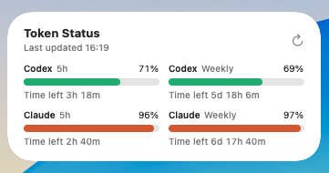

# Token Widget

macOS desktop widget for checking local Codex and Claude usage windows.



## Prompt For An AI Agent

Give this prompt to an AI coding agent on your Mac:

```text
Install https://github.com/im-ian/token-widget locally.
Open the Xcode project and configure it for my Apple Developer account.
Create Config/LocalSigning.xcconfig from the example in the README and fill in values that work for my account.
Build the TokenWidget scheme, not the TokenWidgetWidget extension scheme.
Copy the built TokenWidget.app into ~/Applications and open it once so macOS registers the widget extension.
Install scripts/claude-statusline-wrapper.sh into ~/.claude/scripts/token-widget-statusline-wrapper.sh.
Update ~/.claude/settings.json so Claude Code uses that wrapper as its statusline command.
Verify that Token Status appears in the macOS widget gallery.
```

## What You Need

- macOS with desktop widgets
- Xcode
- An Apple ID signed in to Xcode
- Codex installed locally
- Claude Code installed locally, if you want Claude usage

## Install For Local Use

Clone the repo:

```sh
git clone https://github.com/im-ian/token-widget.git
cd token-widget
```

Open the project:

```sh
open TokenWidget.xcodeproj
```

Create a local signing config. This file is ignored by Git:

```sh
cat > Config/LocalSigning.xcconfig <<'EOF'
TOKEN_WIDGET_DEVELOPMENT_TEAM = YOUR_TEAM_ID
TOKEN_WIDGET_APP_BUNDLE_ID = com.yourname.TokenWidget
TOKEN_WIDGET_WIDGET_BUNDLE_ID = com.yourname.TokenWidget.widget
TOKEN_WIDGET_APP_GROUP_ID = group.com.yourname.token-widget
EOF
```

Use identifiers that are unique to your Apple Developer account. The app bundle id, widget bundle id, and App Group id must all use the same values everywhere.

Build the main app scheme:

```sh
xcodebuild -project TokenWidget.xcodeproj -scheme TokenWidget -configuration Debug -destination 'platform=macOS' -allowProvisioningUpdates build
```

The scheme must be `TokenWidget`. Do not run the `TokenWidgetWidget` scheme for installation; that target is the widget extension, and it does not run the background helper that writes data into the App Group container.

Install the built app into `~/Applications` and open it once:

```sh
mkdir -p ~/Applications
rm -rf ~/Applications/TokenWidget.app
cp -R ~/Library/Developer/Xcode/DerivedData/TokenWidget-*/Build/Products/Debug/TokenWidget.app ~/Applications/
open ~/Applications/TokenWidget.app
```

The app runs as a background-only helper. It does not open a normal desktop window.

Check that macOS registered the widget extension. Replace the bundle id below with your `TOKEN_WIDGET_WIDGET_BUNDLE_ID`:

```sh
pluginkit -m -A | grep com.yourname.TokenWidget.widget
```

Then open the macOS widget gallery and add `Token Status` to the desktop.

If you change bundle ids or App Group ids later, rebuild, copy the app to `~/Applications` again, open it once, then remove and re-add the desktop widget.

## Signing

This project needs a signed local build because macOS widgets run as app extensions. The app and widget also share data through an App Group.

The checked-in defaults are public placeholders:

```text
com.example.TokenWidget
com.example.TokenWidget.widget
group.com.example.token-widget
```

Do not edit project signing values directly for local use. Put your real values in:

```text
Config/LocalSigning.xcconfig
```

Example:

```text
TOKEN_WIDGET_DEVELOPMENT_TEAM = YOUR_TEAM_ID
TOKEN_WIDGET_APP_BUNDLE_ID = com.yourname.TokenWidget
TOKEN_WIDGET_WIDGET_BUNDLE_ID = com.yourname.TokenWidget.widget
TOKEN_WIDGET_APP_GROUP_ID = group.com.yourname.token-widget
```

The project reads signing values from:

- `Config/Signing.xcconfig`
- `Config/LocalSigning.xcconfig`
- `TokenWidget/TokenWidget.entitlements`
- `TokenWidgetWidget/TokenWidgetWidget.entitlements`
- `TokenWidget/Info.plist`
- `TokenWidgetWidget/Info.plist`
- `Shared/TokenUsageStore.swift`

After changing signing or App Group settings, rebuild the `TokenWidget` scheme, copy the app into `~/Applications`, open it once, then remove and re-add the desktop widget.

## Codex Usage

No extra setup is needed for Codex.

The helper reads local Codex rate-limit events from:

```text
~/.codex/sessions
~/.codex/logs_2.sqlite
```

## Claude Usage

Claude usage needs one small statusline wrapper. The wrapper captures Claude Code `rate_limits` and writes them to:

```text
~/.claude/token-widget/claude-rate-limits.json
```

Install the wrapper:

```sh
mkdir -p ~/.claude/scripts
cp scripts/claude-statusline-wrapper.sh ~/.claude/scripts/token-widget-statusline-wrapper.sh
chmod +x ~/.claude/scripts/token-widget-statusline-wrapper.sh
```

Then update `~/.claude/settings.json` so Claude Code uses the wrapper as its statusline command:

```json
{
  "statusLine": {
    "type": "command",
    "command": "bash -lc 'exec \"${CLAUDE_CONFIG_DIR:-$HOME/.claude}/scripts/token-widget-statusline-wrapper.sh\"'"
  }
}
```

If you already use another Claude statusline, set it as a forwarding command:

```json
{
  "env": {
    "TOKEN_WIDGET_STATUSLINE_FORWARD_COMMAND": "your-existing-statusline-command"
  },
  "statusLine": {
    "type": "command",
    "command": "bash -lc 'exec \"${CLAUDE_CONFIG_DIR:-$HOME/.claude}/scripts/token-widget-statusline-wrapper.sh\"'"
  }
}
```

Restart Claude Code after changing `settings.json`.

## Verify

Build the main app:

```sh
xcodebuild -project TokenWidget.xcodeproj -scheme TokenWidget -configuration Debug -destination 'platform=macOS' -allowProvisioningUpdates build
```

Install and open the helper:

```sh
mkdir -p ~/Applications
rm -rf ~/Applications/TokenWidget.app
cp -R ~/Library/Developer/Xcode/DerivedData/TokenWidget-*/Build/Products/Debug/TokenWidget.app ~/Applications/
open ~/Applications/TokenWidget.app
```

Check that macOS registered the widget. Use your `TOKEN_WIDGET_WIDGET_BUNDLE_ID`:

```sh
pluginkit -m -A | grep com.yourname.TokenWidget.widget
```

You should see a line like:

```text
+    com.yourname.TokenWidget.widget(1.0)
```

Check that the helper is running:

```sh
pgrep -fl TokenWidget
```

## Troubleshooting

If the widget does not appear:

1. Confirm you built the `TokenWidget` scheme, not `TokenWidgetWidget`.
2. Copy `TokenWidget.app` into `~/Applications`.
3. Open `~/Applications/TokenWidget.app` once.
4. Confirm `pluginkit` shows your widget bundle id.
5. Remove the widget from the desktop.
6. Add `Token Status` again from the widget gallery.

Run:

```sh
mkdir -p ~/Applications
rm -rf ~/Applications/TokenWidget.app
cp -R ~/Library/Developer/Xcode/DerivedData/TokenWidget-*/Build/Products/Debug/TokenWidget.app ~/Applications/
open ~/Applications/TokenWidget.app
pluginkit -m -A | grep com.yourname.TokenWidget.widget
pluginkit -e use -i com.yourname.TokenWidget.widget
```

If `pluginkit` does not show the widget, check:

1. `TOKEN_WIDGET_APP_BUNDLE_ID` and `TOKEN_WIDGET_WIDGET_BUNDLE_ID` are unique.
2. `TOKEN_WIDGET_APP_GROUP_ID` matches the App Group registered to your Apple Developer account.
3. The same App Group value is used by the app and widget through `Config/LocalSigning.xcconfig`.
4. The app copied into `~/Applications` is the latest build.

If the widget shows stale data:

1. Quit the helper and extension.
2. Remove the widget from the desktop.
3. Open the helper again.
4. Add the widget again.

```sh
pkill -x TokenWidgetWidget || true
pkill -x TokenWidget || true
open ~/Applications/TokenWidget.app
```

If Claude shows no data, open Claude Code once after installing the wrapper, then check:

```sh
ls -l ~/.claude/token-widget/claude-rate-limits.json
```
